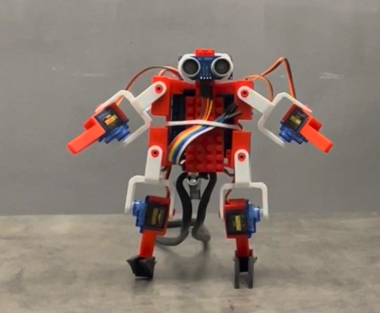
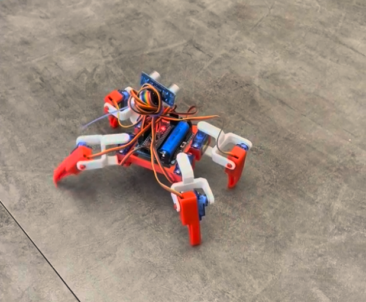

## Развлечение для инженера


*тут три картинки в одной*


Когда я принес домой набор для сборки программируемого робота-квадропода,
сразу появилось желание сделать с ним что-нибудь интересное. 
Про Arduino, конечно, я и раньше знал, но на изучение схемотехники
не было ни желания ни ресурсов. Набор полностью решал этот вопрос - 
вся аппаратная часть была уже сделана. 
Я потратил час на сборку и приступил к экспериментам.

---

## Квадропод

Малыш получился весьма забавный. Демо программа привела в восторг не
только детей, но и меня. В комплекте было приложение для 
визуального программирования квадропода a la Scratch, 
с помощью которого можно было заставить квадропод ходить, поворачиваться,
делать наклоны и много чего еще.

--тут гифка--

https://ondrej-kvasnovsky.medium.com/how-to-convert-video-to-gif-on-macos-821343b6670d



Как-то случайно получилось так, что я расправил лапы квадроподу 
и повернул его пузом к себе. Глаза дальномера довершили картину - 
получился человекоподобный робот. Пути назад не было.

## Робот

Решение для ступней нашлось дня через три. Хотелось сделать
неразрушающую и, одновременно, разбираемую модификацию. Элементы
системы выравнивания плитки я решил использовать сразу. Не сразу
только придумал как. Лапы конусообразные - любые попытки расклинить
их не увенчались успехом - было ненадежно - выдавливались. В итоге,
воспользовался тем, что они полые - в стенках СВП просверлил
отверстия и продел сквозь них и лапу обычную скрепку, закрутив
по концам.

--фото--

Квадропод эволюционировал до прямоходящего робота - стал 
уверенно стоять на ногах.


С Arduino до этого никогда не сталкивался, поэтому решил пойти
по "простому" пути: посмотреть как оно сделано в приложении с блоками
и сделать по аналогии.

Это оказалось возможным - приложение было на Electron с незакрытыми
js файлами. Покопавшись, я примерно понял как управлять сервоприводами, 
чего для начала было достаточно. Внутрь можно было и не 
лазить - в самом приложении сделана кнопка, которая показывает
сгенерированный код. Позже таки пришлось заглянуть в мануал, чтоб
разобраться как отправлять данные в порт, чтоб получить аналог
console.log.

Первая мысль была про обучение программированию детей. Сейчас оно,
зачастую, представлено задачами на управление роботом на экране.
Если двигаться будет не нарисованный, а реальный робот - это
будет гораздо интересней. Тем более, что с реальным роботом
и спектр задач может быть гораздо шире.

Реальность внесла свои корректировки. С двумя сервоприводами на
ногу сделать точное и устойчивое перемещение вперед - непростая задача.
Сделать поворот на точный угол - уже, прям скажем, сложная.
Тут уже ногами из СВП не обойдешься. Такая задача уже выходила 
за рамки развлечения.

Наблюдая за весельем детей под танцы из Just Dance,
я подумал - а может научить робота танцевать?

## Makeba

-- картинка --

И так, танец. Движения в ритм музыки. Приступим.

Для начала, надо разобраться со временем. Чтоб попадать в такт,
нам нужно научиться двигаться с нужной скоростью.
Для управления сервоприводами используется библиотека `VarSpeedServo`,
которая позволяет указать и угол и скорость. Однако, скорость тут - 
величина абстрактная. Нужно привязать ее к конкретной величине.

Я переживал, что зависимость этой абстрактной скорости к реальной
величине будет нелинейной, но, с радостью обнаружил, что все норм.
Экспериментальным путем была выявлена константа,
которую я назвал `anglePerSecondPerSpeedUnit` -
угол, на который изменится положение сервопривода, на единицу 
абстрактной скорости за 1 секунду.

Примерно прикинув, как я буду описывать движения, я пришел к выводу,
что мне нужна функция, которая подвинет сервопривод на определенный
угол за заданное количество миллисекунд.

Для удобства, функция принимает в качестве параметра целевое
положение - то, где сервопривод должен оказаться. Сама
определяет разницу от текущего положения и перемещает 
сервопривод туда, куда надо за нужное время. 
Когда программируешь танец, хочется не думать, где рука, плечо, 
голень была - хочется сказать где она должна оказаться и все.

````
void _moveByTime(int index, int a, int timeMs) {
  int diff = a * _getDirection(index);
  int newAngle = _init[index] + diff;
  int length = abs(_state[index] - newAngle);
  int absSpeed = (long)length * 1000 / timeMs;
  int speed = absSpeed / _anglePerSecondPerSpeedUnit;
  VarSpeedServo servo = _getServo(index);
  servo.slowmove(newAngle, speed > 255 ? 255 : speed);
  _state[index] = newAngle;
}
````

В этой функции больше всего времени я потратил на `(long)`.

...


## Робокот


ps. Отзывчивость поддержки производителя

