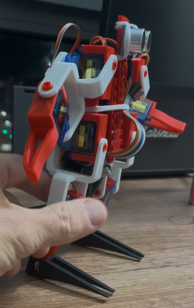

## Развлечение для инженера


Поиграться с программируемым робот всегда было интересно, 
но на изучение схемотехники не было ни ресурсов ни желания.
Поэтому, когда я наткнулся на набор для сборки робота-квадропода,
я его сразу купил. Вся аппаратная часть в нем была уже сделана.

Иногда, вольные эксперименты в какой то области
могут принести неожиданный и занятный результат. 
Предположить, что в итоге получится кот, да еще и 
танцующий - я никак не мог. 
---

## Робот Ползающий

На сборку набора ушло чуть больше часа 
и путь к эспериментам стал открыт.

Малыш получился весьма забавный. Демо программа привела в восторг не
только супругу, детей, котов, но и меня. В комплекте было приложение для визуального программирования a la Scratch, 
с помощью которого можно было заставить его ходить, поворачиваться,
делать наклоны и много чего еще.


Как-то случайно получилось так, что я расправил лапы квадроподу 
и повернул его пузом к себе. Глаза дальномера довершили картину - 
получился человекоподобный робот. Пути назад не было.

## Робот Прямостоящий

Решение для ступней нашлось через пару дней. Хотелось сделать
неразрушающую и одновременно разбираемую модификацию. Элементы
системы выравнивания плитки я решил использовать сразу. Не сразу
только придумал как. Лапы конусообразные - любые попытки расклинить
их не увенчались успехом - было ненадежно - выдавливались. В итоге,
воспользовался тем, что они полые - в стенках СВП просверлил
отверстия и продел сквозь них и сквозь лапу обычную скрепку, закрутив
по концам.


Квадропод эволюционировал до прямоходящего робота - стал 
уверенно стоять на ногах.




## Робот Развивающийся

С Arduino до этого никогда не сталкивался, поэтому решил пойти
по "простому" пути: посмотреть как оно сделано в приложении с блоками
и сделать по аналогии.

Это оказалось возможным - приложение было на Electron с открытыми
js файлами. Покопавшись, я примерно понял как управлять сервоприводами, 
чего для начала было достаточно. Внутрь приложения можно было и не 
лазить - в нем самом сделана кнопка, которая показывает
сгенерированный код. Позже таки пришлось заглянуть в мануал, чтоб
разобраться как отправлять данные в порт, чтоб получить аналог
console.log.

Сначала я захотел научить робота ходить. 
Реальность внесла свои корректировки. С двумя сервоприводами на
ногу сделать точное и устойчивое перемещение вперед - непростая задача.
Сделать поворот на точный угол - уже, прям скажем, сложная.
Тут уже ногами из СВП не обойдешься. Это стало выходить
за рамки развлечения.

Наблюдая за весельем детей под танцы из Just Dance,
я подумал - а может научить робота танцевать?

## Робот Танцующий


И так, танец. Движения в ритм музыки. Приступим.

Для начала, надо разобраться со временем. Чтоб попадать в такт,
нам нужно научиться двигать конечностями с нужной скоростью.
Для управления сервоприводами используется библиотека `VarSpeedServo`,
которая позволяет указать и угол и скорость. Однако, скорость тут - 
величина абстрактная. Нужно привязать ее к конкретной величине.

Экспериментальным путем была выявлена константа,
которую я назвал `anglePerSecondPerSpeedUnit` -
угол, на который изменится положение сервопривода, на единицу 
абстрактной скорости за 1 секунду.

Примерно прикинув, как я буду описывать движения, пришел к выводу,
что мне нужна функция, которая подвинет сервопривод на определенный
угол за заданное количество миллисекунд.

Позже, я изменил интерфейс для большего удобства - 
функция принимает в качестве параметра целевое
положение - то, где сервопривод должен оказаться. Сама
определяет разницу от текущего положения и перемещает 
сервопривод куда надо за нужное время. 
Когда программируешь танец, хочется не думать, где рука, плечо, 
голень были - хочется сказать в какое положение они должный
прийти и за какое время.

````
void _moveByTime(int index, int a, int timeMs) {
  int diff = a * _getDirection(index);
  int newAngle = _init[index] + diff;
  int length = abs(_state[index] - newAngle);
  int absSpeed = length * 1000 / timeMs;
  int speed = absSpeed / _anglePerSecondPerSpeedUnit;
  VarSpeedServo servo = _getServo(index);
  servo.slowmove(newAngle, speed > 255 ? 255 : speed);
  _state[index] = newAngle;
}
````

Код примитивный - что тут может пойти не так? Однако, я сразу  попал на дебаг. На маленьких углах функция работала
идеально, а на больших - сервопривод дрыгался непредсказуемо.
Сперва я подумал, что зависимость реальной скорости к параметру - нелинейная. 
Однако пара тестов показала, что это не так.

Решение нашел через час. И знаете что я вам скажу...


[Это стоит посмотреть целиком](https://pikabu.ru/story/kakaya_gadost_yeta_vasha_dinamicheskaya_tipizatsiya_11491316)


Мой основной рабочий инструмент - Typescript, но это не то же самое.
Когда много лет занимаешься разработкой на языках высокого уровня,
забываешь о том, сколько слоев абстракций лежит под ними, и что
там в самом низу.

Работающий код от неработающего отделяло только `(long)`:

````
  int absSpeed = (long)length * 1000 / timeMs;
````

Остается только добавить историю про [Линуса Торвальдса, джина и три желания](https://pikabu.ru/story/otvet_na_post_yeto_1010_12384900). 

---

Следующим сюрпризом стала длительность такта выбранной музыкальной 
композиции. Я подбирал ее экспериментально - замеряя
секундомером длительность большого количества тактов.
Потом подгонял, сверяя попадание простых движений в такт. 
Результат меня удивил. 

Обычно, для указания темпа используют понятную абсолютную 
целую величину - долю минуты - bpm - beat per minute. 
Также, в нотах к примеру, задают таким же способом длительность 
четверти (1/4 такта при размере 4/4). 
По замерам на большом интервале, длительность такта в 
этой композиции в версии Just Dance составила 1020 миллисекунд. 
Если пересчитать по тактам, получится 58,82 такта в минуту, 
если по четвертям - 235,29 bpm.
Такие значения никак не вписываются в рамки здравого смысла. Рядовые
синтезаторы даже не смогут выдать темп с такой частотой. 

Но. Давайте разделим 1020 на четверти. Четверть
такта в этой композиции в интерпретации Just Dance 
длится 255 миллисекунд. В оригинальном треке длительность такта немного другая. 
Разработчики Ubisoft сделали забавную пасхалку.

----

Разбор танца на движения и программирование робота было рядовой
технической задачей. Хочу только отметить, что научить человека (себя 
или кого-нибудь другого) нужным движениям сильно проще, чем механизм.
Когда человек чувствует ритм - большую часть работы он делает сам - 
достаточно лишь показать. Механизму нужны предельно точные инструкции
относительно того, когда начинать движение и за какое время его надо
выполнить.

Я решил не пытаться делать движения так, чтобы робот сохранял
равновесие и пошел простым путем: пол метра ВВГ 2х6 и хомут - 
решили вопрос устойчивости.


## Робот - кот

Идея придать роботу приятный внешний вид была очевидной.
Стабилизатор сразу был признан хвостом, ну а дальше вариантов
уже не было - тема котов у нас доминирует не только в 
младшем поколении, но и в старшем.

Проведя эксперименты с полосками бумаги, стало понятно,
что при такой конструкции суставов, 
нужен большой запас ткани с внешней стороны сгиба. 
Ткань с внутренней наоборот - будет собираться
в складки. Запас то еще можно пережить, а вот 
складки могут мешать самому механизму. Ткань, которая 
может растягиваться, сначала показалась хорошей идеей.
Однако до практики не дошло: смущала мысль, что она обтянет
суставы и кот выйдет угловатым.

Решение подкинула супруга, сказав - "Давай, я его свяжу!". 
И да, такой вариант подходил идеально: толстая пряжа не 
даст проступить каркасу, в тоже время - вязанная 
ткань будет хорошо тянуться и сжиматься.

Я, конечно, не смог остаться в стороне. Кривоватые ноги-валенки и 
руки-клешни - моих рук дело. 


В красном каркасе-основе обнаружилось два отверстия, которые оказались очень кстати
для того, чтобы закрепить пластиковый уголок, на котором будет держатся голова.

Далее нужно было набить живот и обвязать все части в единую конструкцию. Сложностей это не доставило. 

Усы я сделал, зачистив витую пару.
Добавить раскраску, по образу и подобию
одного из домашних и пару мелких деталей мне тоже помогла супруга.


Вот такой получился зверь:


Ура! Все готово.

Но нет. 

Как это нередко бывает, добавление сложной новой фичи привело к тому, что перестала работать одна из старых.

## Которобот

Которобот вышел хорошим, а вот танцевал он совсем плохо.
В разные моменты вдруг стала происходить перезагрузка: конечности
резко дергались и которобот возвращался к начальному состоянию. Такое могло происходить как ближе к концу танца,
так и в самом начале.

После дебага стало понятно, что причиной такого поведения
является ограниченная подвижность конечностей, которые
теперь окружены связанной тканью.

Идея вязанной кожи себя полностью оправдала - такая
кожа тянется, на ней нет пузырей, в складки не собирается, 
угловатые детали через нее не проступают. Однако она сама
по себе - толстая, что в крайних положениях все-таки приводило к тому, что она мешала движению.
 Этот момент я сразу не учел.

Второй момент, который пришлось решать постфактум - плотность
обвязки деталей между собой. Рук это не касалось, а вот ноги
мной были обвязаны так, что которобот не только на шпагат не мог сесть, но даже небольшие движения ногой в сторону давались ему с трудом.

Оба момента я решил программно: уменьшил углы отклонений конечностей, при которых появлялось излишнее усилие. 
Случайность по времени появления перезагрузки, возможно, объясняется степенью заряда аккумулятора: пока он свежий - серво хватает бодрости или дожать или пережить сложный момент, а когда напряжение аккумулятора падает - в этих ситуациях происходит сброс.

В полевых испытаениях "выяснился" еще и тот факт, что
вязанная ткань плохо скользит по шершавым поверхностям. 
Движение ног, при имеющейся конфигурации - это скольжение.
На поверхностях, где оно плохое, движения ног которобота
крайне скудны.

В целом, хоть и не идеально, результат был достигунт. 
Время оценить отчетный танец.


<iframe width="560" height="315" src="https://www.youtube.com/embed/RMhRv_mIl54?si=gjp4Ljvo0Wqcq9nq" title="YouTube video player" frameborder="0" allow="accelerometer; autoplay; clipboard-write; encrypted-media; gyroscope; picture-in-picture; web-share" referrerpolicy="strict-origin-when-cross-origin" allowfullscreen></iframe>


## Что дальше

Есть идея про начальное обучение программированию детей. Сейчас оно,
зачастую, представлено задачами на управление роботом на экране.
Если двигаться будет не нарисованный, а реальный робот - это
будет гораздо интересней. Интерактивность привлекает.
Тем более, что с реальным роботом
и спектр задач может быть гораздо шире.
Можно сделать конструкцию, которая позволит включить в обучение
состязательный момент. Это мощный мотиватор, который работает
не только для детей.

Есть идея про робота танцора, который сможет танцевать под
любой трек. Технически, "послушать" музыку,
выделить пики в низких частотах, подобрать движения
из подготовленного набора, подстроить скорость - возможно.
Такой робот уже мог бы украсить не только детскую
вечеринку, но и взрослую.

Схемотехника и механика - обширные области. Для того,
чтобы хорошо реализовать какую либо из этих идей,
надо в них плотно погрузиться. 
Моя основная квалификация и сфера интересов - программная часть.
Маловероятно, что когда-нибудь появится время плотно 
погрузится в новую сферу. Но если вы решите
реализовать одну из этих идей - я с удовольствием
или помогу или возьму на себя целиком код.