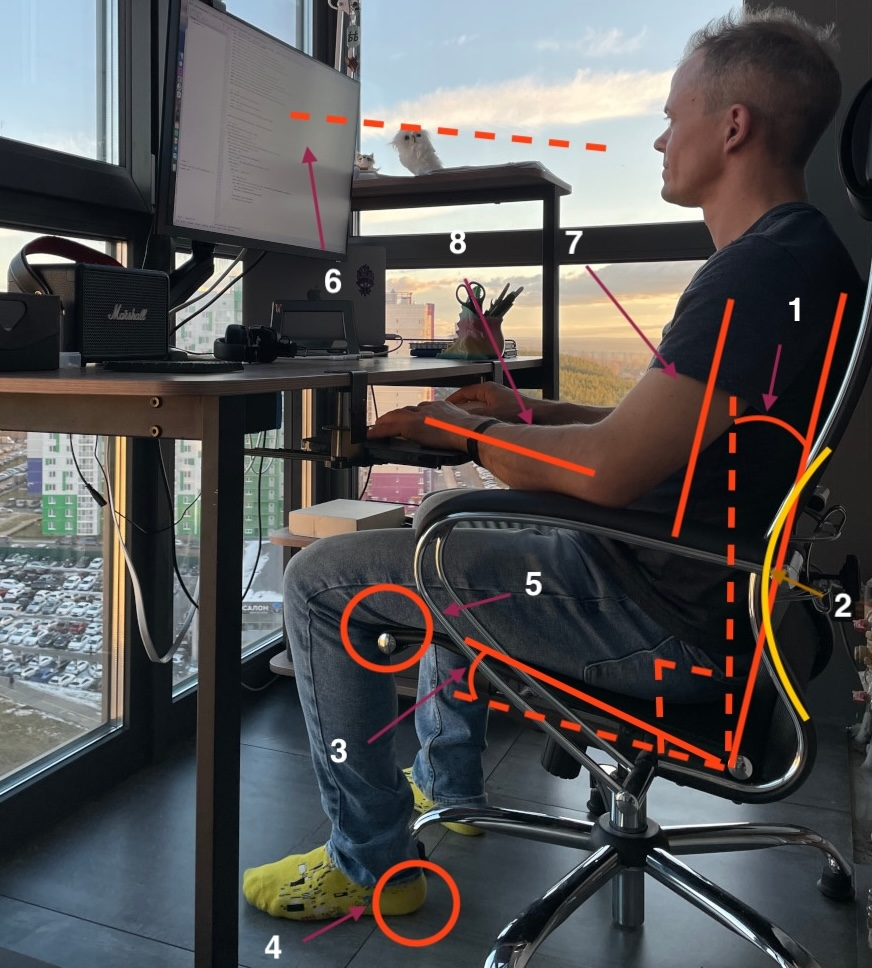
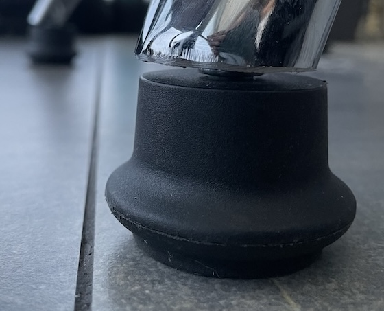
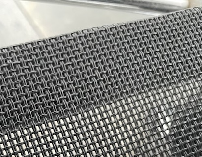

## Жизнь за столом

В 2017-м я перешел на режим удаленной работы, в котором работаю до сих пор. 
Общение - получение задач, обсуждения, совещания, неформальные разговоры - всё стало происходить, 
не отходя от рабочего места. Тогда и начались регулярные попытки сделать пребывание на этом месте комфортней.

За последние два года в списке требований к рабочему месту не добавилось ни одного нового пункта. 
Похоже, я уже нашел все что для меня самом деле важно и готов поделиться этим с вами.

Всё описанные моменты - чистая практика. 
То, что я проверял на себе и что на самом деле добавляло удобства и комфорта. 
Стоит только заметить, что люди разные - как по физическим параметрам, так и по своему отношению к неудобствам. 
Значительную роль играет также характер деятельности. 
То, что является комфортом для меня, для кого-то может быть неудобством. 
Этот набор требований - не догма. Скорее - список того, что можно попробовать, чтоб сделать лучше.

Все восемь важных аспектов рабочего места схематично изображены на картинке, а за деталями, нюансами и
объяснениями прошу пожаловать под кат.

---

### 1. Наклон спинки кресла

Наклоняя спинку кресла назад мы перекладываем часть нагрузки с позвоночника на кресло. 
Просто и очевидно? На самом деле нет. 

### 2. Подпор поясницы

При откидывании спинки, без подпора поясницы сидеть становится наверно еще неудобней,
чем с вертикальной спинкой. Благо большинство современных кресел этот момент учитывают.

### 3. Наклон сидушки

Это обязательный момент, без которого предыдущие два не имеют никакого смысла. 
Когда угол между бедром и спиной больше 90 - долго не просидишь.
Авто-производители это знают: если обратите внимания - сидушки всех водительских 
кресел находятся под углом. А вот почему большинство офисных кресел, 
где есть наклон или возможность наклона спинки и даже подпор поясницы, 
не учитывают эту деталь - для меня загадка.
Благо, практически любое кресло легко и быстро этот наклон может приобрести, 
с помощью ваших рук, пары шайб и удлиненного болта. 
Продавцы кресел, которые знают свое дело, всегда вам дадут их, 
а если нет, найти что нужно можно в магазинах крепежа.

### 4. Ступня на полу

Важно иметь возможность полностью поставить ступню на пол. 
Без этого, у ноги не будет возможности найти позицию, 
при которой она будет стоять без напряжения. 
Вы будете пытаться опереться на ножки кресла, встать на носочки, 
вытянуть ноги вперед или сделать что-то еще, но не найдете позицию, 
при которой нога может стоять полностью расслабленной.
Частичным решением, при невозможности опустить кресло, может быть подставка под ноги. 
Если эта подставка не занимает все пространство под столом - это не полноценное решение,
а компромисс. Ноги не будут постоянно находиться именно в этой позиции, 
поэтому подставка будет или мешаться или временами подпинываться в сторону.

### 5. Бедро на сидушке

Может показаться, что раз важен именно угол между бедрами и спиной, 
то вместо наклона сидушки можно просто поднять ступни подставкой под ноги 
или опусканием кресла. Да, это создаст нужный угол, и спине будет комфортно. 
Но это также приподнимет бедро над сидушкой, в части ближе к колену. 
При таком положении, колени легко могут двигаться влево-вправо. 
Чтоб сохранять положение, придется их контролировать - напрягаться.
Чтоб не тратить ресурсы на поддержание позиции колен, 
надо чтоб при поставленной на пол ступне, бедра уверенно лежали на сидушке. 

### 6. Монитор на уровне глаз

Ноутбук, пожалуй, самый распространенный формат рабочего компьютера для удаленщиков. 
Да, больше всего времени мы работаем за стационарным рабочим местом, 
но грех не пользоваться мобильностью. Монитор ноутбука неразрывно связан с клавиатурой, 
что заставляет работать, нагнув голову немного вниз. 
Такой наклон никак негативно не влияет, когда он длится недолго. 
Неделю, другую - в отпуске или командировке - можно отработать без проблем и так. 
Год и более работать в таком положении - не вариант. 
Вы, может, и привыкнете к тому, что шея затекает, но позвоночник вам этого не простит.

Смотреть надо вперед, а не вниз (особенно раз мы усугубили проблему, отклонив спину назад). 
Если нет возможности купить или разместить внешний монитор, можно просто купить 
внешнюю клавиатуру, а ноутбук поставить на подставку.
Отдельная рекомендация тем, у кого близорукость: расстояние до монитора должно быть 
таким, чтоб вы без напряжения глаз могли разглядеть любой важный текст. 
Это можно достигнуть не только средствами коррекции зрения (очки, линзы), 
но и придвигая монитор ближе к себе или настраивая размер шрифтов. 
Близорукость прогрессирует при напряжении в попытке разглядеть что-то вдали: 
за рабочим местом мы можем себя от этого избавить.

### 7. Плечо вниз

Если для того, чтобы достать до клавиатуры или мышки, приходится тянуть руки вперед, 
также вперед будет тянуться и плечо. Даже если локоть будет уверенно и 
твердо лежать - долго находиться в таком положении будет неудобно. 
Плечо не должно быть сильно выдвинутым вперед.
Чтобы иметь возможность зафиксировать руки, существуют столы с вырезами. 
Подразумевается, что вы придвигаете кресло так, чтобы локти попали на стол. 
Минус в том, что обеспечить комфортное положение плеча с таким столом не получится. 
Локоть, обычно, ниже плоскости стола - положив предплечье на стол, он уйдет вперед, 
вместе с плечом.
Самый простой и верный способ - подлокотники кресла.

### 8. Кисть на одной прямой с предплечьем

Запястье стоит держать на одной прямой с предплечьем. 
Неудобства проявятся небыстро, но неизбежно. 
Впрочем, дискомфорт от загнутой кисти ощущается практически сразу. 
Если прислушиваться к сигналам организма, туннельного синдрома можно не бояться.
Если клавиатура и мышка находится выше локтя, 
то для обеспечения нужного положение запястья, 
клавиатуру можно приподнять с дальнего края.

### Вариант реализации

Сделать рабочее место за адекватные деньги, в котором были бы учтены все моменты, 
не так уж и сложно. Начать выбор кресла можно по высоте сидушки: 
нужно чтоб она опускалась так, чтоб ступня стояла полностью на полу. 
Надо учесть, что если наклон сидушки вы будете делать сами, 
это добавит под коленом еще 2-3см. Нужно убедиться что есть нужный наклон спинки 
или возможность регулировки. Подлокотники есть практически у каждого кресла, 
а наклон сидушки можно сделать самостоятельно.

Найти готовый стол, удовлетворяющий сразу всем критериям у меня 
так и не получилось. Взял просто тот, который понравился и добавил 
полку под клавиатуру. Вот и все.

Могу добавить от себя пару дополнений. 
Стулья обычно идут на колесиках. Когда вы возвращаетесь на рабочее место, 
приходится тратить время, чтобы подкатить стул и найти нужную позицию. 
Можно проще: вместо колесиков поставить просто ножки. Надо только учесть, что при этом, 
для того чтоб покинуть рабочее место, кресло надо повернуть. 
При некоторых конфигурациях стола и подлокотников это может не получиться.

Когда на кресле вы проводите много времени подряд, стоит учесть, что кожа (своя)
в тепле и без доступа воздуха - нагревается и имеет свойство потеть. Матерчатые
покрытия кресла при таком режиме труда подойдут лучше, чем плотные (кожа и имитация).
Лучшим решением в этом случае, я считаю покрытие - сетку.

